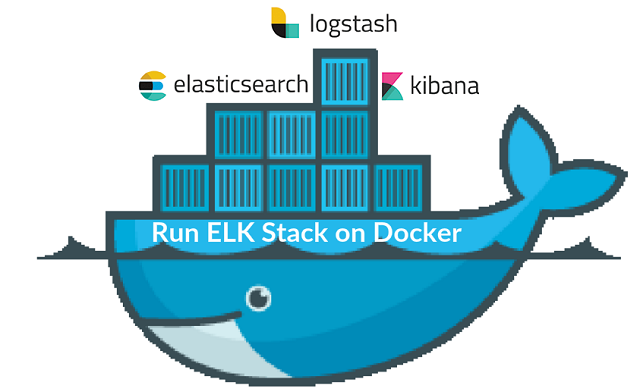
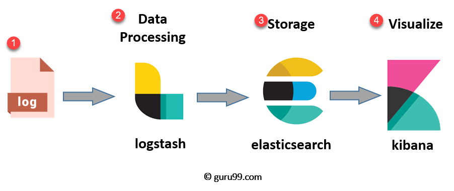
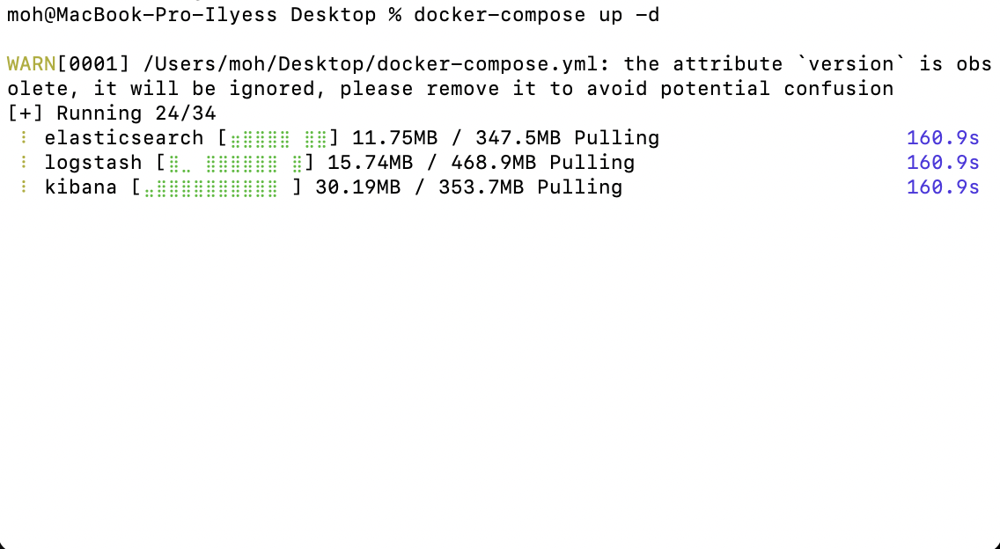
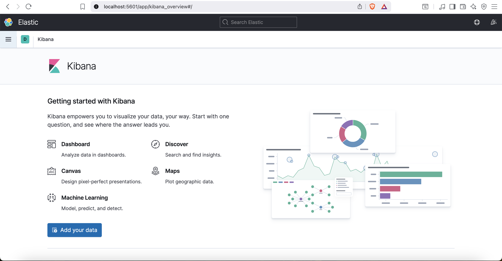
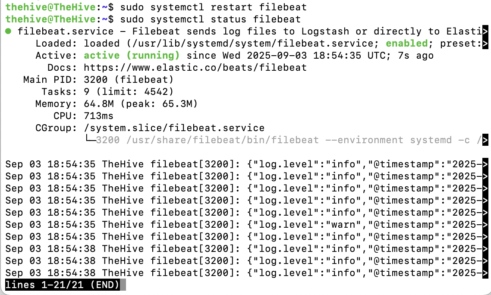
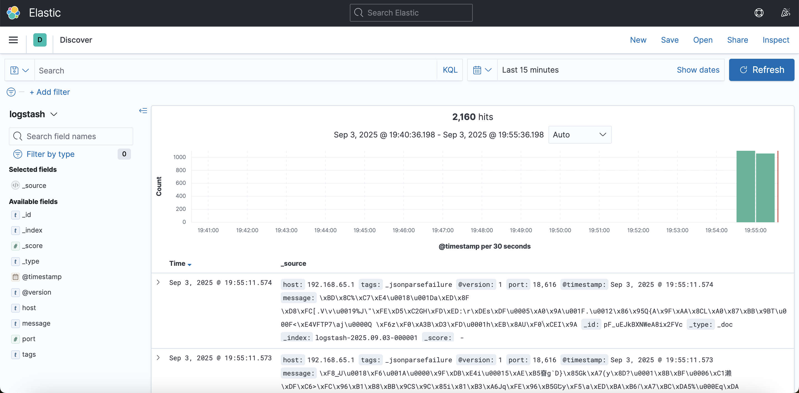

# ELK Sandbox Lab – Dockerized ELK Stack for Log Collection, Analysis, and Visualization



---

## 1. Project Overview

**ELK Sandbox Lab** is a hands-on, educational project designed to help security analysts and system administrators learn how to deploy and manage the ELK stack (Elasticsearch, Logstash, Kibana) using Docker.

This project demonstrates:

- How to dockerize the ELK stack for local or server environments.

- How to install Filebeat on Linux servers.

- How to forward system and application logs to ELK via Logstash.

- Basic log visualization and exploration in Kibana.

It is perfect for analysts who want a **safe, sandbox environment** to experiment with SIEM concepts and log processing pipelines.

---


## 2. Architecture



**Flow Explanation**:

- Filebeat collects logs from the Ubuntu server.
- Logstash receives, parses, and forwards logs.
- Elasticsearch stores and indexes the logs.
- Kibana provides visualization and analysis capabilities.


---


## 3. Project Requirements

### System Requirements

- Docker >= 20.x
- Docker Compose >= 1.29.x
- Ubuntu 20.04+ (or any Linux server for Filebeat)
- Minimum 4 GB RAM for Docker ELK stack

### Software Requirements

- ELK Stack Docker images ( Elasticsearch & Logstash & Kibana v7.10.2)
- Filebeat (installed on Linux server)

### Network Requirements

- Docker bridge network for ELK containers.
- Port access (Elasticsearch: `9200`, Logstash: `5044`, Kibana: `5601`)


---


## 4. Docker-Compose and Configuration Overview

### docker-compose.yml

This file defines the multi-container ELK stack and its configuration.

**Elasticsearch**

- Single-node cluster (`discovery.type=single-node`)

- Java heap size: 512MB (`ES_JAVA_OPTS=-Xms512m -Xmx512m`)

- Security enabled (`xpack.security.enabled=true`)

- Default superuser credentials (username: `elastic` && password: `changeme`)

- Port `9200` exposed to host

**Logstash**

- Custom pipeline configuration mounted from `./logstash/pipeline`

- Java heap size: 256MB (`LS_JAVA_OPTS=-Xms256m -Xmx256m`)

- Listens on port `5044` for Filebeat input

- Depends on Elasticsearch

**Kibana**

- Connects to Elasticsearch at `http://elasticsearch:9200`

- Exposes web UI on port `5601`

- Depends on Elasticsearch

**Network**

- Custom bridge network elk for container communication


### logstash/pipeline/pipeline.conf

This is the Logstash pipeline configuration file:

```conf
input {
  tcp {
    port => 5044
    codec => json_lines
  }
}

output {
  stdout { codec => rubydebug }
  elasticsearch {
    hosts => ["http://elasticsearch:9200"]
    user => "elastic"
    password => "changeme"
    index => "filebeat-%{+YYYY.MM.dd}"
  }
}
```

- Input Section: Receives logs from Filebeat agents on port `5044`.
- Filter Section: Optional filters to parse, enrich, or modify logs.
- Output Section: Sends processed logs to Elasticsearch and prints to console for debugging.


---


## 5. Getting Started

### 5.1 Clone the Repository

```bash
git clone https://github.com/ilyess-sellami/ELK-Sandbox-Lab.git
cd ELK-Sandbox-Lab
```

### 5.2 Start ELK Stack with Docker
Bring up all services in detached mode:
```bash
docker-compose up -d
```




Check that containers are running:
```bash
docker ps
```
You should see:
- `elasticsearch` running on port `9200`
- `logstash` running on port `5044`
- `kibana` running on port `5601`

## 5.3 Access Kibana
Open your browser and navigate to:
```bash
http://localhost:5601
```
Login using default credentials:
- **Username**: `elastic`
- **Password**: `changeme`

Once authenticated, you will see the **Kibana dashboard** where you can explore and visualize logs.




### 5.4 Install and Configure Filebeat on Linux

Add the Beats Repository (APT):
```bash
wget -qO - https://artifacts.elastic.co/GPG-KEY-elasticsearch | sudo apt-key add -
sudo apt-get install apt-transport-https
echo "deb https://artifacts.elastic.co/packages/9.x/apt stable main" | sudo tee -a /etc/apt/sources.list.d/elastic-9.x.list
```
Update APT and install Filebeat:
```bash
sudo apt-get update && sudo apt-get install filebeat
```
Configure Filebeat to Send Logs to Logstash:
```bash
sudo nano /etc/filebeat/filebeat.yml
```
Set the Logstash output:
```yml
filebeat.inputs:
- type: log
  enabled: true
  paths:
    - /var/log/*.log

output.logstash:
  hosts: ["<ELK_SERVER_IP>:5044"]
```
Replace `<ELK_SERVER_IP>` with your ELK Docker host IP.

Enable and Start Filebeat:
```bash
sudo systemctl enable filebeat
sudo systemctl start filebeat
```
Check status:
```bash
sudo systemctl status filebeat
```



### 5.5 Verify Logs in Kibana
After starting Filebeat and ensuring logs are being sent, you can view them in Kibana.

**Create an Index Pattern**

1. Go to **Stack Management → Index Patterns**.

2. Click **Create Index Pattern**.

3. Enter: `filebeat-*`

4. Select the **@timestamp** field.

5. Click **Create index pattern**

**Explore Logs**

1. Go to **Discover**.

2. Select the `filebeat-*` index pattern.

3. You should see logs from your Ubuntu server, like system logs or application logs.




---


## 6. Conclusion

The **ELK Sandbox Lab** project provides a complete, hands-on environment for learning how to deploy and manage the ELK stack using Docker.

By completing this lab, you have learned how to:

Dockerize Elasticsearch, Logstash, and Kibana for easy deployment.

Enable Elasticsearch security and configure Kibana with credentials.

Install and configure Filebeat on a Linux server to forward logs to Logstash.

Verify log ingestion and explore logs in Kibana’s dashboard.

Create index patterns, filters, and visualizations for real-time log analysis.

This sandbox is ideal for security analysts, system administrators, and anyone looking to gain practical experience with **SIEM concepts, log management, and the ELK stack**.